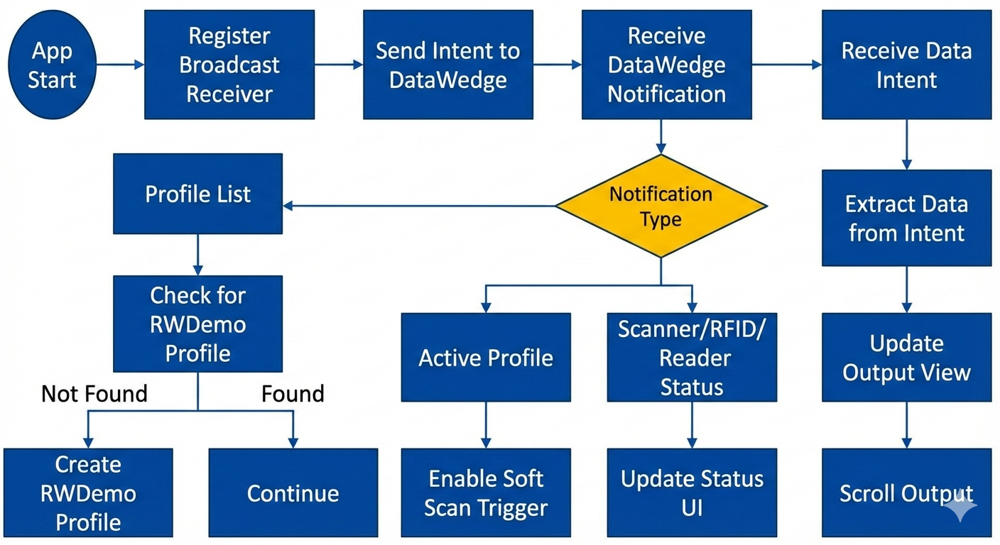

## Design Flowchart

Below is the main design flowchart for the RWDemo app:

# Zebra RFID RWDemo - Design

## Scope
Android demo app that reads RFID data through Zebra DataWedge intent APIs and renders live status + tag results.

Current implementation focus:
- Stable profile setup and activation
- Reliable status updates (scanner / RFID / reader)
- Session-based read UX with deduped output and counters
- Compatibility: Removed custom DataWedge plugin views for v0.0.1

## Runtime Architecture

### Main components

### Data path
1. App registers receiver for DataWedge result + notification actions.
2. App ensures `RWDemo` profile exists/active.
3. DataWedge sends RFID payload in intent extras.
4. `handleDecodeData(Intent)` parses payload and updates counters/output.

## Runtime Architecture

### Main components
- `RWDemoActivity`: Main activity, handles UI, DataWedge profile management, scan event processing, and lifecycle.
- `RWDemoIntentParams`: Constants for DataWedge intent API integration.
- (Removed) Custom DataWedge plugin views: NumberPicker, dwRulesListView, dwTokensListView, dwActionsListView (for compatibility).

### Main Logic Flow
1. App starts, initializes UI and Data Binding.
2. Sets up DataWedge profile (creates if missing).
3. Registers broadcast receivers for DataWedge notifications and results.
4. Waits for events:
	- On scan intent: parses data, dedupes, updates counters and output view.
	- On status/connection change: updates UI, plays beep if needed.
5. Handles activity lifecycle (onCreate, onResume, onPause, onStop, onDestroy) to manage receivers, profile checks, and UI state.

### Flowchart
See `flowchart TD.mmd` for a visual summary of the main logic and event flow.

## UI Contract

Header status fields in `dwdemo_main.xml`:
- `scannerStatus`: scanner state (`S: ...`)
- `rfidStatus`: RFID state (`RFID: reading/stopped/...`)
- `readerStatus`: reader state (`RD: ...`)
- `readCountStatus`: running counters (`Total: X  Unique: Y`)

Result area:
- `output_view` shows only first-seen tags for current reading session.

## Reading Session Behavior

### Session start
When reading starts (soft trigger start or RFID SCANNING notification):
- previous output is cleared
- total/unique counters reset
- session flag is marked active

### During session
- every incoming row increments **Total**
- **Unique** increments only when dedupe key is new
- only newly unique rows are appended to `output_view`

### Session stop
When reading stops:
- session flag resets
- next start triggers a fresh clear/reset

## Dedupe Rules

For each row:
1. trim leading/trailing whitespace
2. skip empty rows
3. normalize dedupe key by removing whitespace and hyphen (`[\\s-]`)
4. lowercase using `Locale.ROOT`

Equivalent examples (same unique key):
- `AB-CD`
- `AB CD`
- `abcd`

## Platform Notes
- Android 13+ receiver registration uses `Context.RECEIVER_EXPORTED`.
- Debug deployment package ID is `com.zebra.rfid.rwdemo.debug`.

## Build and Deploy
- Build: `./gradlew assembleDebug`
- APK: `app/build/outputs/apk/debug/app-debug.apk`
- Install: `adb install -r app/build/outputs/apk/debug/app-debug.apk`
- Launch: `adb shell am start -n com.zebra.rfid.rwdemo.debug/com.zebra.rfid.rwdemo.RWDemoActivity`

## Future Cleanup Candidates
- replace deprecated APIs (`setBackgroundDrawable`, legacy `getColor`/`getDrawable` patterns)
- reduce static mutable activity fields
- extract decode/session logic into testable helper class

## Diagnostics and Operations

### Expected runtime signals
- `scannerStatus` changes with scanner notifications.
- `rfidStatus` should move between `reading` and `stopped`.
- `readCountStatus` should increment on incoming data (`Total`) and first-seen tags (`Unique`).

### Quick verification sequence
1. Build and deploy debug APK.
2. Launch app and confirm status fields are populated.
3. Start reading and confirm previous session data is cleared once.
4. Scan repeated tag variants (case/space/hyphen differences) and verify dedupe behavior.

### Common failure points
- Missing Gradle wrapper JAR prevents build.
- No active `adb` device prevents deploy.
- DataWedge profile not active prevents intent delivery.
